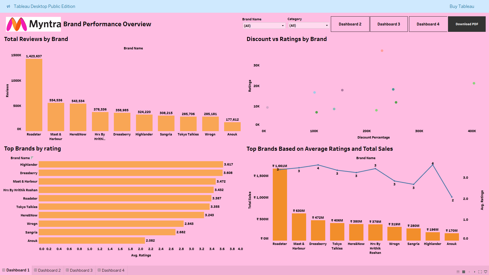
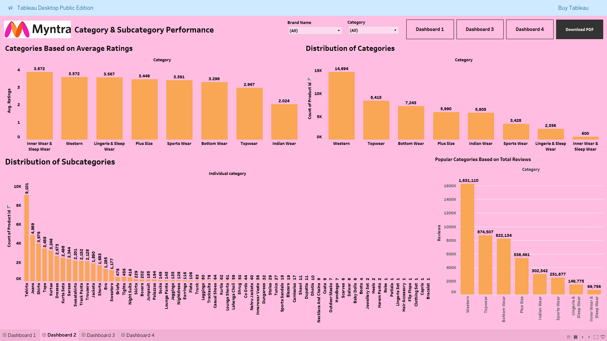
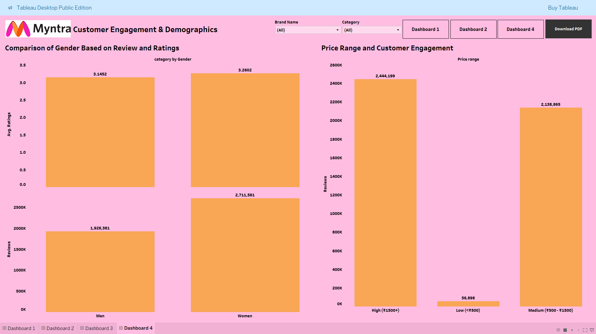
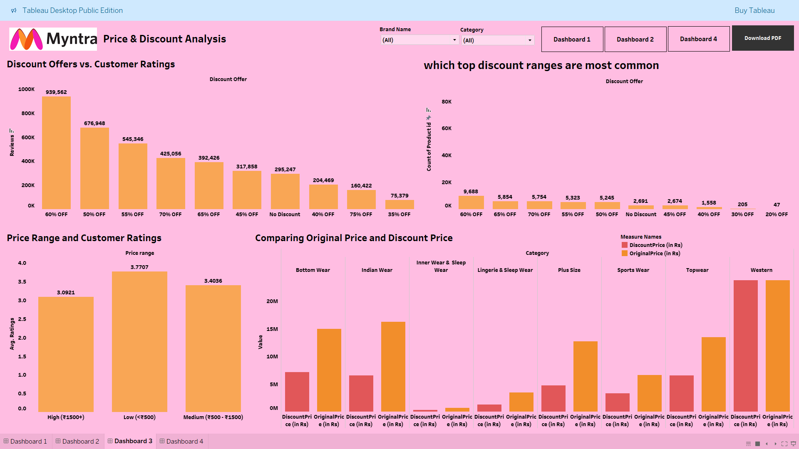

# 🛍️ Myntra Customer Behaviour & Sales Analytics Dashboard (Tableau)

An interactive Tableau dashboard that analyzes **customer behavior, pricing strategy, product performance, and brand insights** using Myntra fashion dataset.

This project demonstrates **end-to-end data analytics, EDA, and dashboard storytelling** using Tableau.

---

---

# Live Dashboard Link
https://public.tableau.com/views/Myntracustomeranalysis/Dashboard4?:language=en-GB&:sid=&:redirect=auth&:display_count=n&:origin=viz_share_link

---

# 📌 Project Overview

E-commerce companies rely heavily on customer data to understand:

- Buying behavior
- Pricing sensitivity
- Customer engagement
- Brand performance

This project transforms raw Myntra product data into **interactive Tableau dashboards** that help uncover patterns in:

- Customer reviews ⭐
- Pricing & discounts 💰
- Product popularity 👕
- Brand performance 📈
- Customer demographics 👥

---

# ❗ Problem Statement

Online fashion platforms handle thousands of products and reviews, making it difficult to:

- Identify top-performing brands
- Understand customer preferences
- Optimize pricing strategies
- Analyze product engagement
- Improve low-performing categories

This project solves the problem by building **multi-dashboard analytics in Tableau**.

---

# 🎯 Project Objectives

- Analyze brand performance using reviews, ratings, and sales
- Understand category & subcategory popularity
- Evaluate pricing and discount strategies
- Study customer engagement patterns
- Identify opportunities for business growth

---

# 📊 Dataset Information

📂 Dataset Source:  
Kaggle – Myntra Fashion Dataset  
https://www.kaggle.com/datasets/manishmathias/myntra-fashion-dataset

Dataset includes:

- Product categories & subcategories
- Brand names
- Prices & discount percentages
- Customer ratings & reviews
- Gender & product distribution

---

# 🛠️ Tools & Technologies Used

| Tool | Purpose |
|------|--------|
| Tableau | Dashboard Development |
| Excel / CSV | Data Cleaning |
| Exploratory Data Analysis | Insights Generation |

---

# 🔄 Project Workflow

1️⃣ Data Cleaning & Preparation  
2️⃣ Exploratory Data Analysis (EDA)  
3️⃣ Feature Understanding & Aggregation  
4️⃣ Dashboard Design in Tableau  
5️⃣ Insights & Recommendations  

---

# 🧹 Data Cleaning & Preparation

Key steps:

- Removed missing and duplicate records
- Standardized category names
- Created calculated fields:
  - Price Range Buckets
  - Discount Categories
  - Customer Engagement Metrics
- Aggregated reviews and ratings by brand & category

---

# 🔍 Exploratory Data Analysis (EDA)

Main analysis areas:

- Brand performance & reviews
- Category popularity
- Pricing vs ratings relationship
- Discount effectiveness
- Customer engagement by gender

---

# 📈 Key Insights & Findings

## 🏷️ Brand Performance Insights

Top brands based on reviews:

- **Roadster** → 1.42M reviews (highest engagement)
- Mast & Harbour → 554K reviews
- Here & Now → 543K reviews

Top brands by ratings:

- Highlander ⭐ 3.61
- Dressberry ⭐ 3.60
- Mast & Harbour ⭐ 3.47

👉 High review count does not always mean highest rating.

---

## 👗 Category Insights

Top categories by product count:

- Western → 14,694 products
- Topwear → 8,415 products
- Bottomwear → 7,243 products

Highest rated categories:

- Innerwear & Sleepwear ⭐ 3.87
- Western ⭐ 3.57
- Lingerie & Sleepwear ⭐ 3.56

Most reviewed categories:

- Western → 1.63M reviews
- Topwear → 874K reviews
- Bottomwear → 822K reviews

---

## 💸 Pricing Insights

Customer rating by price range:

| Price Range | Avg Rating |
|-------------|-----------|
| Low (<₹500) | ⭐ **3.77** |
| Medium (₹500–₹1500) | ⭐ 3.40 |
| High (₹1500+) | ⭐ 3.09 |

👉 Budget-friendly products receive **better ratings**.

---

## 🎯 Discount Insights

Most common discount:

- **60% OFF** products dominate the platform

Highest review engagement:

- 60% OFF → 939K reviews
- 50% OFF → 676K reviews

👉 Heavy discounts significantly increase engagement.

---

## 👥 Customer Engagement Insights

Gender comparison:

| Gender | Reviews | Avg Rating |
|--------|--------|------------|
| Women | 2.71M | ⭐ 3.26 |
| Men | 1.92M | ⭐ 3.14 |

👉 Women generate **higher engagement and slightly higher ratings**.

---

# 📊 Dashboard Pages

## 1️⃣ Brand Performance Dashboard
- Total reviews by brand
- Discount vs ratings analysis
- Sales vs rating comparison

## 2️⃣ Category & Subcategory Dashboard
- Category popularity
- Subcategory distribution
- Average ratings by category

## 3️⃣ Customer Engagement Dashboard
- Gender-based engagement
- Price range vs engagement

## 4️⃣ Price & Discount Analysis Dashboard
- Discount effectiveness
- Price vs rating analysis
- Discount vs product distribution

---

# 💼 Business Impact / Recommendations

📌 Increase inventory for high-review categories (Western, Topwear)  
📌 Maintain strong discount strategy (50–60% range)  
📌 Focus marketing on women shoppers (higher engagement)  
📌 Improve quality in high-price segments (lower ratings)  
📌 Promote top-rated brands for better conversion  

---

# ▶️ How to Use

1. Install Tableau Desktop / Tableau Public  
2. Open the file:

Myntra customer analysis.twbx

3. Explore dashboards interactively.

---

# 🖼️ Dashboard Screenshots

### Brand Performance Overview Page

### Category & Subcategory Performance Page

### Customer Engagement & Demographics Page

### Price & Discount Analysis Page

---

# 👨‍💻 Author

**Mithun Adhe**  
Data Analyst | Tableau Developer  

🔗 GitHub: https://github.com/MithunAdhe

---

⭐ If you like this project, consider giving it a star!
